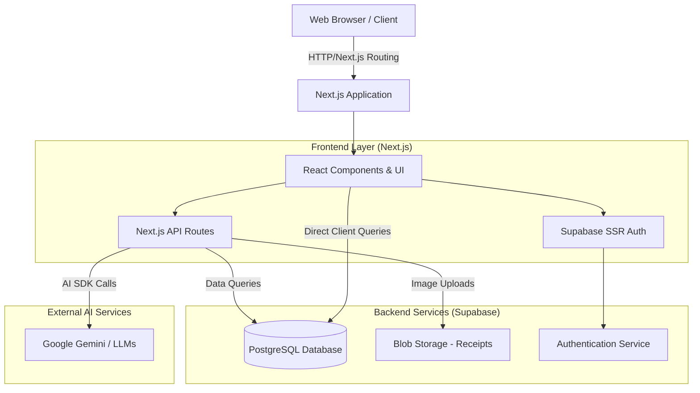
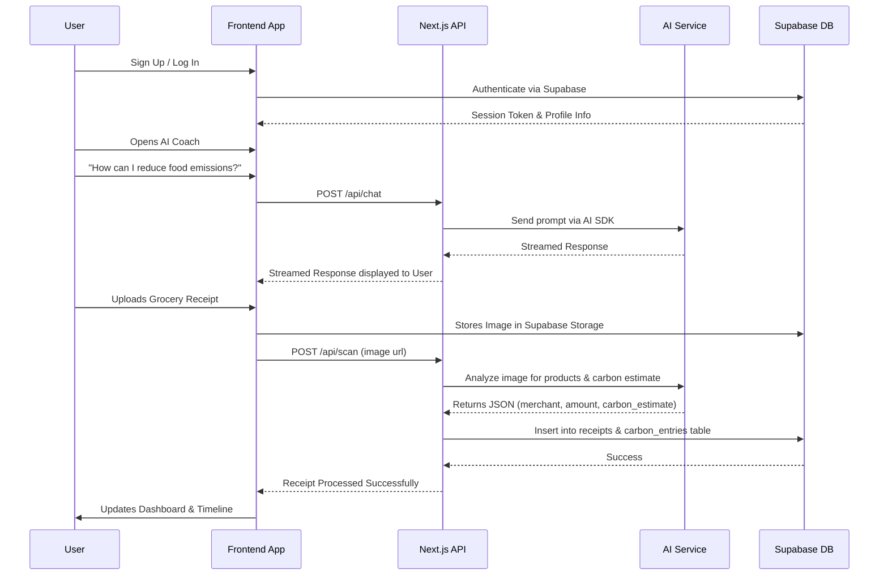

# 🌍 EcoTrack AI - Sustainable Intelligence Platform

EcoTrack AI is a modern, comprehensive platform designed to empower individuals to track, understand, and reduce their carbon footprint using the power of Artificial Intelligence. 

## ✨ Key Features

- **📊 Intelligent Dashboard:** View your sustainability grade, carbon saved, and personalized insights.
- **🤖 AI Sustainability Coach:** Chat with an AI assistant to get actionable advice on reducing emissions.
- **📸 Receipt Scanner:** Upload receipts and let AI estimate the carbon footprint of your purchases.
- **🎯 Goals & Challenges:** Set personal reduction targets or compete in community challenges.
- **📈 Comprehensive Tracking:** Manually track daily activities and monitor your progress over time.

## 🛠️ Technology Stack

- **Frontend:** Next.js (App Router), React 19
- **Styling:** Tailwind CSS v4, shadcn/ui, "Liquid Glass" design aesthetic
- **Backend & Database:** Supabase (PostgreSQL)
- **Authentication:** Supabase Auth (SSR)
- **AI Integration:** Vercel AI SDK (`@ai-sdk/google`)

---

## 🏗️ Architecture Overview

The application follows a decoupled modern stack, with Next.js serving as both the frontend and API layer, and Supabase providing robust backend services.



---

## 🔄 User Journey & Data Flow

How a user interacts with the platform, specifically focusing on the core tracking features:



---

## 🚀 Getting Started

### Prerequisites
- Node.js (v18 or higher)
- npm, yarn, or pnpm
- A Supabase project (for database and auth)

### Installation

1. **Navigate to the frontend directory**:
   ```bash
   cd frontend
   ```

2. **Install dependencies**:
   ```bash
   npm install
   ```

3. **Environment Setup**:
   Create a `.env.local` file in the `frontend` directory based on `.env.local.example`. You will need to provide your Supabase URL, Anon Key, and Google AI API Key.
   ```env
   NEXT_PUBLIC_SUPABASE_URL=your_supabase_url
   NEXT_PUBLIC_SUPABASE_ANON_KEY=your_supabase_anon_key
   GOOGLE_GENERATIVE_AI_API_KEY=your_google_ai_key
   ```

4. **Run the development server**:
   ```bash
   npm run dev
   ```

5. **Open the App**:
   Navigate to [http://localhost:3000](http://localhost:3000) in your browser.

---

## 🗄️ Database Schema Structure

The application uses a PostgreSQL database hosted on Supabase, featuring robust Row Level Security (RLS).

- `profiles`: User information, linked directly to the authentication system.
- `activities`: A standardized catalog of activities and their carbon factors.
- `carbon_entries`: Specific actions logged by users and their calculated footprint.
- `goals`: User-defined sustainability targets.
- `challenges` & `user_challenges`: Community-driven gamification tables.
- `receipts`: AI-processed receipt logs storing image URLs and estimated footprints.

## 🎨 Design System

EcoTrack AI utilizes a **"Liquid Glass"** aesthetic. This entails:
- **Luminous Layering**: Transparent panels with subtle backdrop blurs (20px-40px).
- **Organic Precision**: Squircle-smoothed corners (24px radius for main panels).
- **Lush Monochrome**: Utilizing a spectrum of greens (Emerald, Forest, Lime) against mint-tinted dark and light surfaces.
