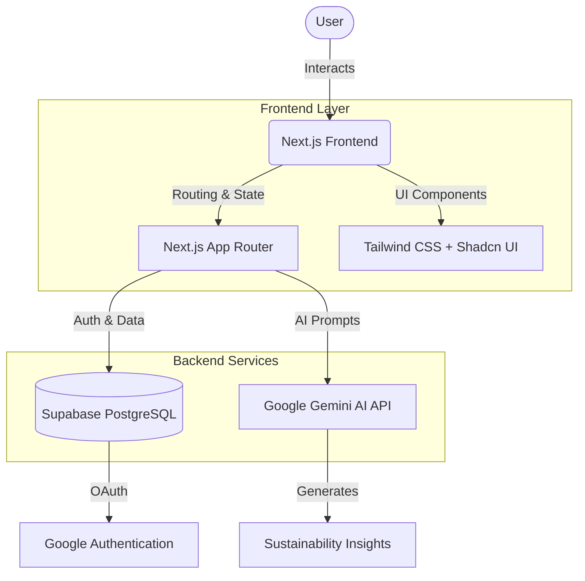
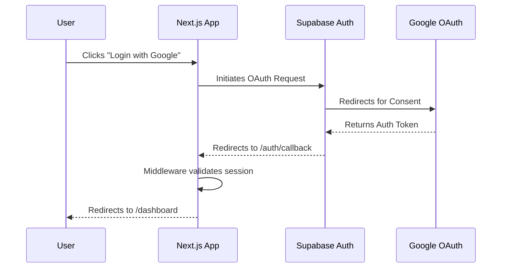

# 🍃 EcoTrack AI

EcoTrack AI is an intelligent sustainability dashboard that helps users track, analyze, and reduce their carbon footprint. Powered by AI and real-time data, it acts as a personal sustainability coach, offering actionable insights and goal-tracking to promote eco-friendly habits.

## ✨ Features

- **📊 Comprehensive Dashboard:** Visualize your carbon footprint, sustainability grade, and goal progress in real-time.
- **🧠 AI Sustainability Coach:** Powered by **Google Gemini**, get personalized advice, weekly goals, and instant analysis of your habits.
- **🔐 Secure Authentication:** Seamless Google OAuth login powered by **Supabase**.
- **📱 Responsive UI:** A beautiful, responsive, and accessible interface built with Tailwind CSS and Next.js.
- **☁️ Cloud-Ready:** Optimized for seamless deployment on Vercel.

## 🏗️ Architecture

The application is built on a modern, serverless stack designed for speed and scalability.



## 🚀 Getting Started

### Prerequisites
- Node.js 18.x or later
- npm or yarn
- A [Supabase](https://supabase.com/) account
- A Google Gemini API Key

### Installation

1. **Clone the repository:**
   ```bash
   git clone https://github.com/YourUsername/EcoTrack-AI.git
   cd EcoTrack-AI
   ```

2. **Install dependencies:**
   ```bash
   npm install
   ```

3. **Environment Setup:**
   Create a `.env.local` file in the root directory and add the following keys:
   ```env
   NEXT_PUBLIC_SUPABASE_URL=your_supabase_project_url
   NEXT_PUBLIC_SUPABASE_ANON_KEY=your_supabase_anon_key
   GOOGLE_GENERATIVE_AI_API_KEY=your_gemini_api_key
   ```

4. **Run the development server:**
   ```bash
   npm run dev
   ```
   Open [http://localhost:3000](http://localhost:3000) with your browser to see the app.

## 🗄️ Database Setup (Supabase)

The project relies on a PostgreSQL database. You need to apply the migrations and seed data for the dashboard to function correctly.

1. Go to your Supabase Dashboard -> SQL Editor.
2. Run the initial schema file to create the tables.
3. Ensure you have updated the **Site URL** and **Redirect URLs** in the Supabase Auth settings to match your deployed environment (or `localhost:3000` for development).

## 🔒 Authentication Flow



## 🛠️ Tech Stack

- **Framework:** Next.js 15+ (App Router)
- **Styling:** Tailwind CSS 4
- **Database & Auth:** Supabase
- **AI Integration:** Vercel AI SDK + Google Gemini 
- **Deployment:** Vercel

## 📄 License
This project was built for hackathon purposes.
